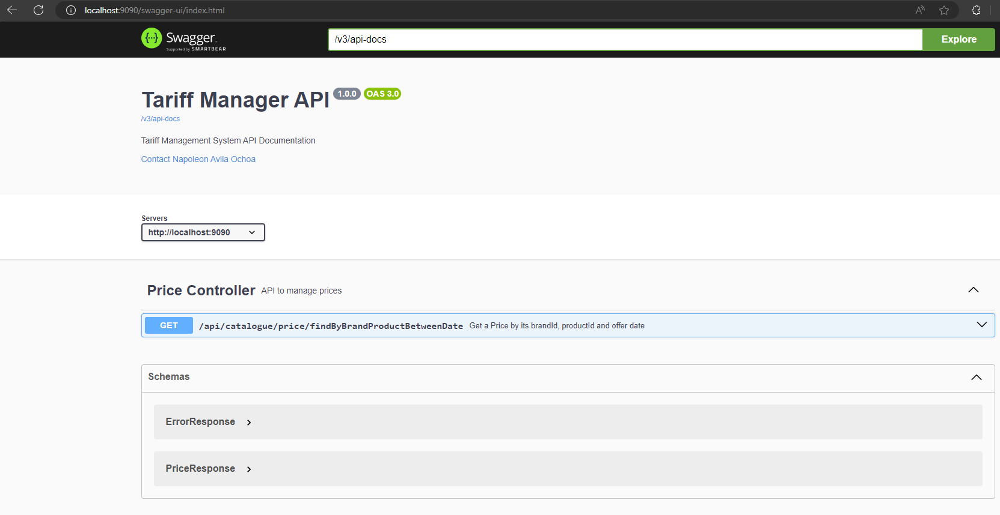
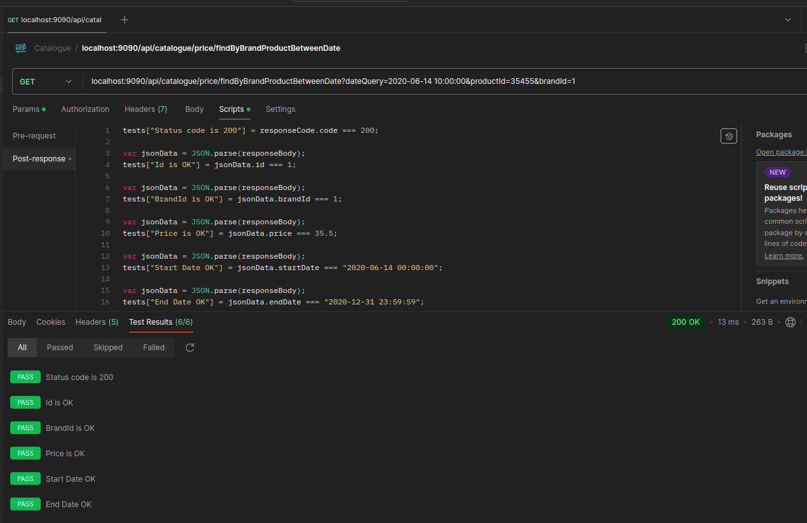

# Lista de Precios MS Spring Boot

Desarrollo de un microservicio implementando clean code y arquitectura hexagonal con el framework SpringBoot.

Esta aplicación utiliza una Base de Datos H2, que es una Base de Datos en memoria.

### Descripción de la arquitectura

Se propone una arquitectura hexagonal (Driven-Driving), destacando dos tipologías de elementos dentro de la misma, los puertos y los adaptadores.

La arquitectura sugiere que el dominio sea el núcleo de las capas y que este no se acople a nada externo. En lugar de depender de implementaciones concretas, se acopla a contratos (interfaces o puertos) mediante el principio de inversión de dependencias.

Los conceptos principales son:

* **Puerto:** Definición de una interfaz pública.
* **Adaptador:** Especialización de un puerto para un contexto concreto.

Esta estructura, donde el dominio es el núcleo de todas las capas (o regiones) y no se acopla a nada externo, es coherente con el enfoque de Domain Driven Design (DDD).


La implementación en Spring Boot se detalla a continuación:

* **Application (modulo application):** En este módulo se definen los puertos driving y driven, y se desarrolla la lógica de negocio. El caso de uso (UseCase) es una implementación del puerto driving y utiliza puertos driven cuando es necesario, como se muestra en el diagrama en el centro. Además, en este módulo también se definen las clases que conforman nuestro dominio.


* **Driving Side (modulos driving):** Estos módulos utilizan los puertos driving, como se ve en la parte azul del diagrama, permitiendo al exterior (consumidor de Kafka, API REST) interactuar con el dominio.


* **Driven Side (modulos driven):** Estos módulos implementan los puertos driven, como se ve en la parte roja del diagrama, permitiendo que el dominio interactúe con el exterior (base de datos, buckets, producción en Kafka, cliente REST).

Adicionalmente, existe un módulo **(Boot)** que define el ensamblado de los distintos módulos de la aplicación en un paquete .jar. Este módulo contiene la clase que ejecuta el microservicio y agrupa los módulos funcionales (API REST y repositorio, etc.).


### Compilación e Inicio
Para compilar y tener todos los recursos, ejecuta el siguiente comando:

```bash
mvn clean install
```

Para iniciarlo bastará con el comando:

```bash
java -jar boot/target/tariff-manager-web-back-boot-1.0.0.jar
```

### Swagger de la aplicación

Accede a la interfaz de Swagger en el siguiente enlace:

* http://localhost:9090/swagger-ui/index.html



### Pruebas

Recomendamos utilizar Postman importando la colección desde este enlace:

* [Catalogue.postman_collection_V2.json](https://github.com/NAO2503/tariff-manager-web-back/blob/main/boot/src/main/resources/Catalogue.postman_collection_V2.json)

### Ejemplo de petición <font color="green">GET</font>

* http://localhost:9090/api/catalogue/price/findByBrandProductBetweenDate?dateQuery=2020-06-14%2010:00:00&productId=35455&brandId=1


